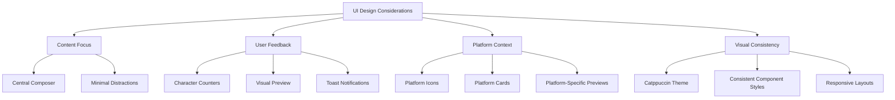
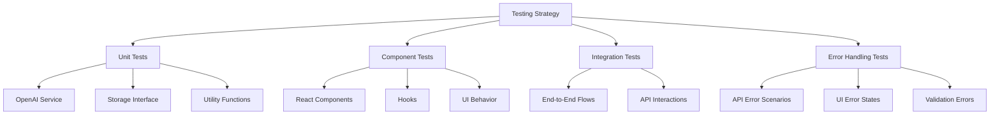

  userId: number;
  content: string;
  mediaFiles: MediaFile[];
  platforms: Platform[];
  createdAt: Date;
  updatedAt: Date;
}
```

#### Post
```typescript
{
  id: number;
  userId: number;
  content: string;
  mediaFiles: MediaFile[];
  platforms: Platform[];
  status: string;        // 'pending', 'published', 'failed'
  createdAt: Date;
}
```

#### MediaFile
```typescript
{
  id: string;
  name: string;
  type: string;
  size: number;
  url: string;
  previewUrl?: string;
}
```

#### Platform
```typescript
{
  id: string;           // 'bluesky', 'mastodon', 'threads'
  isSelected: boolean;
  accounts?: number[];  // Account IDs
}
```

#### ThreadPost
```typescript
{
  id: string;
  content: string;
  index: number;
}
```

#### CharacterStat
```typescript
{
  platform: string;
  current: number;
  limit: number;
  percent: number;
}
```

#### SplittingStrategy
```typescript
enum SplittingStrategy {
  SEMANTIC = "semantic",           // Split by meaningful semantic chunks
  SENTENCE = "sentence",           // Split by sentences
  RETAIN_HASHTAGS = "retain_hashtags",  // Ensure hashtags are preserved
  PRESERVE_MENTIONS = "preserve_mentions"  // Make sure @mentions stay intact
}
```

#### SplittingConfig
```typescript
{
  name: string;
  strategies: SplittingStrategy[];
  id?: string;
  timestamp?: number;
}
```

#### AdvancedOptions
```typescript
{
  useThreadNotation: boolean;
  threadNotationFormat: string;
  showRawJson: boolean;
  customMastodonLimit: number;
  showReasoning: boolean;
}
```

## Frontend Components

### Main Components

#### PostComposer
The central component for creating posts. Manages content, platform selection, and posting actions.

```typescript
interface PostComposerProps {
  content: string;
  mediaFiles: MediaFile[];
  characterStats: CharacterStat[];
  selectedPlatforms: { id: string; isSelected: boolean; accounts?: number[] }[];
  advancedOptions: AdvancedOptions;
  isPendingDraft: boolean;
  isPendingPost: boolean;
  isPendingUpload: boolean;
  isFormValid: boolean;
  threadPosts: ThreadPost[];
  isThreadMode: boolean;
  activeThreadIndex: number;
  onContentChange: (content: string) => void;
  onTogglePlatform: (platformId: string) => void;
  onAdvancedOptionsChange: (options: Partial<AdvancedOptions>) => void;
  onUploadFiles: (files: File[]) => void;
  onRemoveMediaFile: (fileId: string) => void;
  onSaveAsDraft: () => void;
  onSubmitPost: () => void;
  onResetForm: () => void;
  onSwitchThreadPost: (index: number) => void;
  onAddThreadPost: (content?: string) => void;
  onRemoveThreadPost: (index: number) => void;
  onExitThreadMode: () => void;
  onApplySplit?: (strategy: SplittingStrategy, platformId: string, splitText: string[]) => void;
  accounts?: Account[];
}
```

#### ThreadPostsManager
Manages thread creation, editing, and navigation.

```typescript
interface ThreadPostsManagerProps {
  threadPosts: ThreadPost[];
  activeIndex: number;
  onSwitchPost: (index: number) => void;
  onAddPost: (content?: string) => void;
  onRemovePost: (index: number) => void;
  onContentChange: (content: string) => void;
  onExit: () => void;
}
```

#### AISplitPreview
Displays AI-generated splitting options for long content.

```typescript
interface AISplitPreviewProps {
  content: string;
  isOpen: boolean;
  accounts: Account[];
  characterStats: CharacterStat[];
  onClose: () => void;
  onApplySplit: (strategy: SplittingStrategy, platformId: string, splitText: string[]) => void;
  advancedOptions?: {
    showRawJson?: boolean;
    [key: string]: any;
  };
}
```

#### PlatformPreview
Shows how content will appear on different platforms.

```typescript
interface PlatformPreviewProps {
  content: string;
  mediaFiles: MediaFile[];
  activeTab: string;
  accounts: Account[];
  onTabChange: (tab: string) => void;
}
```

#### PlatformCard
Displays a platform with toggle functionality.

```typescript
interface PlatformCardProps {
  platform: Platform;
  charCount: number;
  active: boolean;
  onToggle: (platformId: string) => void;
}
```

#### SplitWithAIButton
Button to trigger AI splitting for long content.

```typescript
interface SplitWithAIButtonProps {
  content: string;
  isContentTooLong: boolean;
  accounts: Account[];
  characterStats: CharacterStat[];
  onApplySplit: (strategy: SplittingStrategy, platformId: string, splitText: string[]) => void;
  advancedOptions?: {
    showRawJson?: boolean;
    [key: string]: any;
  };
}
```

#### SavedSplittingConfigs
Manages saved AI splitting configurations.

```typescript
interface SavedSplittingConfigsProps {
  selectedStrategies: SplittingStrategy[];
  savedConfigs: SplittingConfig[];
  onSaveConfig: (name: string) => void;
  onLoadConfig: (config: SplittingConfig) => void;
  onDeleteConfig: (configName: string) => void;
}
```

### Custom Hooks

#### usePostForm
Manages form state for creating and editing posts.

```typescript
interface UsePostFormProps {
  initialContent?: string;
  initialPlatforms?: { id: string; isSelected: boolean }[];
  initialMediaFiles?: MediaFile[];
  initialAdvancedOptions?: Partial<AdvancedOptions>;
}
```

Returns:
```typescript
{
  formState: PostFormState;
  accounts: Account[];
  drafts: Draft[];
  isFormValid: boolean;
  isPendingDraft: boolean;
  isPendingPost: boolean;
  isPendingUpload: boolean;
  updateContent: (content: string) => void;
  updateAdvancedOptions: (options: Partial<AdvancedOptions>) => void;
  togglePlatform: (platformId: string) => void;
  toggleAccount: (platformId: string, accountId: number) => void;
  uploadFiles: (files: File[]) => void;
  removeMediaFile: (fileId: string) => void;
  saveAsDraft: () => void;
  submitPost: () => void;
  loadDraft: (draftId: number) => void;
  deleteDraft: (draftId: number) => void;
  resetForm: () => void;
  setActivePreviewTab: (tab: string) => void;
  setupThread: (posts: string[]) => void;
  switchThreadPost: (index: number) => void;
  addThreadPost: (content?: string) => void;
  removeThreadPost: (index: number) => void;
  exitThreadMode: () => void;
}
```

#### useToast
Manages toast notifications.

## Backend Services

### API Routes

- **GET /api/user**: Get the current user
- **GET /api/accounts**: Get all accounts for the current user
- **GET /api/accounts/:platformId**: Get accounts for a specific platform
- **GET /api/drafts**: Get all drafts for the current user
- **GET /api/drafts/:id**: Get a specific draft
- **POST /api/drafts**: Create a new draft
- **PUT /api/drafts/:id**: Update a draft
- **DELETE /api/drafts/:id**: Delete a draft
- **POST /api/posts**: Create and publish a post
- **GET /api/platforms/character-limits**: Get character limits for each platform
- **POST /api/upload**: Upload media files
- **POST /api/split-post**: Split a post using AI
- **POST /api/optimize-post**: Optimize a post for a specific platform

### OpenAI Service

The `openaiService.ts` handles AI-powered post splitting and optimization.

#### Main Functions:

- **splitPost**: Splits a post into multiple posts based on selected strategies
- **generateSplittingOptions**: Generates different splitting options
- **optimizePost**: Optimizes a post for a specific platform

## AI Integration

The application uses OpenAI's GPT-4o model to split and optimize content:

1. When a post exceeds character limits, the user can click "Split with AI"
2. Multiple splitting strategies can be selected simultaneously:
   - Semantic splitting (keeping related content together)
   - Sentence splitting (at natural sentence boundaries)
   - Hashtag retention (keeping hashtags intact)
   - Mention preservation (ensuring @mentions stay together)
3. The AI considers all selected strategies together rather than applying them individually
4. Thread optimization is included in all strategies by default
5. The AI provides reasoning for its splits which can be displayed to the user
6. Multiple splitting options can be saved and loaded

### OpenAI API Integration

The application uses OpenAI's GPT-4o model for several key features:

1. **API Key Management**:
   - The application checks for the presence of the OpenAI API key at server startup
   - Key validation happens before making API requests
   - Detailed error messages for missing or invalid keys

2. **Error Handling**:
   - Comprehensive error handling for OpenAI API responses
   - User-friendly error messages with suggestions for resolution
   - Specific handling for common errors (rate limits, quota exceeded)
   - Detailed error logging for debugging

3. **GPT-4o Prompt Engineering**:
   - Structured system prompts that combine multiple splitting strategies
   - JSON response formatting for consistent parsing
   - Thread optimization instructions built into every prompt
   - Character limit enforcement based on platform requirements
 
4. **Response Validation**:
   - Safety checks for malformed API responses
   - Thread indicator format validation to ensure two newlines before thread markers
   - Automatic correction of improperly formatted thread indicators
   - Handling for unexpected response formats
   - Fallback mechanisms for failed requests
   - Structured error propagation to client

## State Management

Post form state is managed through the `usePostForm` hook, which handles:

1. Content updates
2. Platform selection
3. Media file uploads
4. Draft saving/loading
5. Post submission
6. Advanced options
7. Thread management

Local storage is used to persist:
- Advanced options
- Custom character limits
- Splitting configurations
- Thread state

## Thread Management

Thread creation and management is handled through:

1. **ThreadPostsManager**: UI component for thread navigation and editing
2. **usePostForm.setupThread**: Converts a single post into a thread
3. **Thread State**: Maintained in both component state and localStorage
4. **Event Handling**: All thread-related buttons use proper event handling to prevent form submission

Thread functionality includes:
- Creating threads from scratch
- Converting long posts into threads using AI
- Adding/removing thread posts
- Navigating between posts
- Previewing complete threads
- Exiting thread mode safely

### Thread Formatting Standard

Thread indicators follow a consistent formatting rule to ensure readability:

- Thread indicators (like "🧵 2 of 3") are always preceded by two newlines
- This ensures clear visual separation between post content and thread indicators
- This formatting is applied automatically whether using manual thread creation or AI-based splitting
- Example of proper thread formatting:
  ```
  Blake's 7 featured early representation with diverse casting and strong female characters. Its finale is one of TV's most shocking. Available on streaming platforms—give it three episodes. Fair warning: don't get attached to anyone.

  🧵 2 of 3
  ```

## Installation & Setup

### Prerequisites
- Node.js (v14+)
- npm (v6+)
- OpenAI API key (for AI-powered features)

### Installation Steps
1. Clone the repository
2. Install dependencies:
   ```
   npm install
   ```
3. Set up environment variables:
   - Create a `.env` file with the following:
     ```
     OPENAI_API_KEY=your_openai_api_key
     ```
   - Or use Replit's Secrets management to add the OPENAI_API_KEY
4. Start the development server:
   ```
   npm run dev
   ```

### OpenAI API Key
The application requires an OpenAI API key for AI-powered features:
- Post splitting based on character limits
- Content optimization for different platforms

If the OpenAI API key is missing or invalid, the application will:
1. Log an error message on the server
2. Return detailed error responses from API endpoints
3. Display user-friendly error messages in the UI
4. Include suggestions for fixing the issue

To obtain an OpenAI API key:
1. Create an account at [OpenAI](https://openai.com/)
2. Navigate to API key management
3. Generate a new API key
4. Add it to your environment as OPENAI_API_KEY

## Configuration

### Platform Configuration
Platform settings are defined in `client/src/lib/platform-config.ts`:

```typescript
export const DEFAULT_PLATFORMS: Platform[] = [
  {
    id: 'bluesky',
    isSelected: true,
  },
  {
    id: 'mastodon',
    isSelected: true,
  },
  {
    id: 'threads',
    isSelected: true,
  }
];

export const PLATFORM_CHARACTER_LIMITS: Record<string, number> = {
  bluesky: 300,
  mastodon: 500,
  threads: 500,
};
```

### Advanced Options
Advanced options are stored in localStorage:
- Thread notation format: ${index+1}/${total}
- Custom Mastodon character limit
- Show AI reasoning toggle
- Raw JSON display toggle

## Theming

The application features a comprehensive theming system based on the Catppuccin color palette:

### Catppuccin Theme Framework

The Catppuccin theme framework provides a cohesive and visually pleasing appearance with four distinct theme flavors:

1. **Latte** - Light theme with soft, warm colors
2. **Frappé** - Dark theme with medium contrast (default)
3. **Macchiato** - Dark theme with higher contrast
4. **Mocha** - Dark theme with rich, saturated colors

### Theme Implementation Details

- **Default Theme**: The application defaults to the Frappé theme (dark mode)
- **Theme Selection**: Users can switch between themes using the theme selector in the header
- **Theme Categories**: Themes are organized into Light (Latte) and Dark (Frappé, Macchiato, Mocha) categories
- **Persistence**: Selected theme preference is saved to localStorage
- **System Preference**: On first visit, the theme will respect the user's system preference (dark/light)

### Theme Architecture

- **CatppuccinThemeProvider**: Context provider that manages theme state and localStorage persistence
- **useCatppuccinTheme**: Custom hook to access current theme and theme-switching functions
- **Theme Variables**: CSS variables defined in `tailwind.config.ts` connected to Catppuccin color values
- **Theme-Aware Components**: UI components that adapt their appearance based on the active theme

### Color Palette Integration

- **Social Icons**: Platform icons adapt colors based on theme for optimal visibility
- **Platform Cards**: Backgrounds and text colors adjust based on theme
- **UI Elements**: All interface elements use theme-aware color variables
- **Contrast Optimization**: Text and background colors are carefully paired to maintain readability

### Theme Customization

The theme implementation uses Tailwind CSS and CSS variables, allowing for:

1. **Consistent Styling**: All components share the same color definitions
2. **Easy Extensibility**: New components automatically inherit theme colors
3. **Accessibility**: Color contrasts meet WCAG guidelines across all themes
4. **Performance**: Theme switching happens without page reloads

## API Reference

### POST /api/split-post
Split a post using AI.

Request:
```json
{
  "content": "Long post content to split...",
  "strategies": ["semantic", "sentence", "retain_hashtags", "preserve_mentions"],
  "customMastodonLimit": 500
}
```

Success Response:
```json
{
  "semantic": {
    "bluesky": {
      "splitText": ["Part 1...", "Part 2..."],
      "strategy": "semantic",
      "reasoning": "Split explanation..."
    },
    "mastodon": {
      "splitText": ["Part 1...", "Part 2..."],
      "strategy": "semantic",
      "reasoning": "Split explanation..."
    }
  },
  "sentence": {
    // Similar structure
  }
}
```

Error Response:
```json
{
  "message": "Failed to split post",
  "error": "Invalid OpenAI API key provided. Please check your API key.",
  "code": "invalid_api_key",
  "suggestion": "Please check that your OpenAI API key is correctly configured."
}
```

Error codes include:
- `invalid_api_key`: The OpenAI API key is invalid
- `missing_api_key`: The OpenAI API key is not configured
- `rate_limit_exceeded`: Too many requests to OpenAI API in a short time
- `insufficient_quota`: OpenAI API usage quota has been exceeded

### POST /api/optimize-post
Optimize a post for a specific platform.

Request:
```json
{
  "content": "Long post content to optimize...",
  "platform": "bluesky",
  "customMastodonLimit": 500
}
```

Success Response:
```json
{
  "optimized": "Optimized content for the specified platform..."
}
```

Error Response:
```json
{
  "message": "Failed to optimize post",
  "error": "OpenAI rate limit exceeded. Please try again after a short wait.",
  "code": "rate_limit_exceeded",
  "suggestion": "Please wait a few moments and try again."
}
```

### POST /api/posts
Publish a post.

Request:
```json
{
  "content": "Post content",
  "mediaFiles": [],
  "platforms": [
    {
      "id": "bluesky",
      "isSelected": true,
      "accounts": [1]
    }
  ]
}
```

Response:
```json
{
  "id": 1,
  "content": "Post content",
  "status": "published",
  "createdAt": "2025-05-11T12:30:45.123Z"
}
```

## Workflow States

The application includes a workflow named 'Start application' that runs `npm run dev`, which starts both the Express server for the backend and the Vite server for the frontend.

## Error Handling

The application provides comprehensive error handling:

1. **API Errors**: Detailed error messages from the backend
2. **OpenAI Errors**: Enhanced error handling for API key issues, rate limits, etc.
   - Missing API key detection
   - Invalid API key handling
   - Rate limit exceeded notifications
   - Quota exceeded warnings
   - Detailed error explanations with suggestions
3. **Validation Errors**: Form validation using Zod schemas
4. **UI Feedback**: Toast notifications for success/error states
5. **Thread Navigation**: Safe handling of thread state to prevent data loss
   - Event propagation control (preventDefault, stopPropagation)

## Design Decisions

### UI Design Philosophy

Multipost's UI design follows several key principles:

1. **Focus on Content Creation**: The main post composer is centrally positioned and takes visual priority, allowing users to focus on their content without distractions.

2. **Progressive Disclosure**: Advanced features are accessible but not overwhelming. For example, AI splitting options appear only when relevant (when content exceeds platform limits).

3. **Platform-Specific Contextual Information**: Character counters and platform previews provide immediate feedback on how content will appear on each platform.

4. **Consistent Visual Language**: The Catppuccin color palette ensures visual consistency throughout the application, with careful attention to contrast and accessibility.



### Why Theme-Aware Components?

The decision to implement theme-aware components was made to:

1. **Enhance User Experience**: Different users have different preferences for light vs. dark themes. By supporting both and defaulting to the user's system preference, the application feels more native and personalized.

2. **Reduce Eye Strain**: Dark themes (Frappé, Macchiato, Mocha) reduce eye strain in low-light environments, while the light theme (Latte) works better in bright environments.

3. **Brand Consistency**: The Catppuccin palette provides a cohesive look across all aspects of the application while allowing for theme variety.

4. **Technical Implementation**: Using CSS variables and Tailwind's theme extension mechanism allows for theme switching without page reloads, ensuring a smooth user experience.

### Component Design Decisions

Each major component was designed with specific goals in mind:

1. **PostComposer**:
   - **Why a central textarea?** Provides a familiar, distraction-free writing experience.
   - **Why platform toggles?** Allows users to selectively target specific platforms while seeing immediate feedback on character limits.
   - **Why a tabbed preview?** Enables users to see how their post will look on each platform without cluttering the UI.

2. **ThreadPostsManager**:
   - **Why a numbered navigation?** Makes it easy to see the sequence and navigate between posts in a thread.
   - **Why inline addition/removal?** Provides immediate control over thread structure without modal dialogs that would interrupt workflow.

3. **AISplitPreview**:
   - **Why show multiple strategies?** Different content types benefit from different splitting approaches, and user preferences vary.
   - **Why show reasoning?** Transparency in AI decisions builds trust and helps users understand why certain splits were made.
   - **Why allow strategy combination?** Complex posts may benefit from multiple strategies applied simultaneously, providing more nuanced results.

## Performance Considerations

The application was built with performance in mind:

### Frontend Performance

1. **React Query Caching**: API responses are cached to minimize redundant network requests. This improves perceived performance, especially when navigating between views.

   ```mermaid
   graph LR
       A[User Action] --> B{Cached?}
       B -->|Yes| C[Use Cached Data]
       B -->|No| D[Fetch New Data]
       D --> E[Update Cache]
       C --> F[Render UI]
       E --> F
   ```

2. **Lazy Loading**: Components that aren't immediately needed are lazy-loaded to reduce initial bundle size and improve time-to-interactive.

3. **Debouncing**: Content updates are debounced to prevent excessive re-renders and API calls during rapid typing.

   ```mermaid
   graph TD
       A[User Types] --> B[Debounce]
       B --> C{500ms Passed?}
       C -->|No| D[Wait]
       C -->|Yes| E[Process Update]
       D --> C
   ```

4. **Optimized Re-renders**: Components use React.memo and careful state management to prevent unnecessary re-renders.

### Backend Performance

1. **Efficient OpenAI Requests**: The application optimizes OpenAI API usage by:
   - Sending only necessary context in prompts
   - Using the most appropriate model settings
   - Implementing request batching when appropriate
   - Reusing response data when possible

2. **Memory Optimization**: The in-memory storage is designed to minimize memory usage while maintaining quick access patterns.

3. **Response Compression**: The Express server uses compression middleware to reduce network payload sizes.

## Testing & Quality Assurance

The application includes comprehensive testing to ensure reliability:

### Testing Strategy



### Test Coverage

The application includes tests for:

1. **Component Tests**:
   - Platform Card rendering and interaction
   - Thread Posts Manager functionality
   - Character Stats display
   - Form validation

2. **Service Tests**:
   - OpenAI integration
   - Thread indicator formatting
   - Content splitting strategies

3. **Hook Tests**:
   - Post form state management
   - Theme handling
   - Media upload processing

### Testing Utilities

Custom testing utilities include:

1. **renderWithProviders**: A wrapper around React Testing Library's render function that includes the necessary providers (React Query, Theme).

2. **Mock Data**: Comprehensive mock data for platforms, accounts, drafts, and media files.

3. **Mock Implementations**: Services like OpenAI are mocked to allow testing without actual API calls.

## Deployment

The application can be deployed through Replit Deployments:

### Deployment Process

1. Complete development and testing in the Replit environment
2. Ensure all configurations are properly set
3. Add required secrets (OPENAI_API_KEY) to the environment
4. Use the "Deploy" button in Replit interface
5. The application will be available at a `*.replit.app` domain

### Deployment Considerations

1. **Environment Variables**: Ensure OPENAI_API_KEY is set in the production environment
2. **Storage**: The current implementation uses in-memory storage, so data will be reset on service restart
3. **Scaling**: For production use with many users, consider implementing a database storage solution
4. **Monitoring**: Add logging and monitoring for production usage

## Troubleshooting

### Common Issues and Solutions

1. **OpenAI API Issues**:
   - **Error: "API key not found"** - Ensure OPENAI_API_KEY is set in environment variables
   - **Error: "Rate limit exceeded"** - Implement exponential backoff or request throttling
   - **Error: "Invalid API key"** - Verify the API key is correct and hasn't expired

2. **UI Issues**:
   - **Theme not persisting** - Check localStorage access and browser cookie settings
   - **Preview not updating** - Verify React state update logic in form hooks
   - **Character counts incorrect** - Check the character counting logic for emoji and special characters

3. **Performance Issues**:
   - **Slow response times** - Check network request timing and consider optimizing API calls
   - **High memory usage** - Review the in-memory storage implementation for potential memory leaks

### Debugging Tips

1. Use the browser developer tools to:
   - Monitor network requests
   - Check console logs
   - Inspect React component state with React DevTools
   - Analyze performance with Performance tab

2. Server-side logging:
   - Enable detailed logging in development with `NODE_ENV=development`
   - Check API response payloads for errors
   - Monitor OpenAI API usage and response times

## Contributing

### Development Workflow

1. **Setup**: Follow the installation steps to set up the development environment
2. **Feature Branches**: Create a branch for each new feature or bug fix
3. **Testing**: Ensure all tests pass before submitting changes
4. **Documentation**: Update README and code comments as needed
5. **Pull Requests**: Submit PR with clear description of changes

### Code Style

- Follow consistent TypeScript practices
- Use descriptive variable and function names
- Comment complex logic
- Maintain component separation of concerns
- Use React hooks appropriately

## Screenshots & UI Components

The UI is built with a clean, modern design using shadcn/ui components:

1. **Main Composer**: Text area with character counting and platform selection
2. **Platform Cards**: Visual toggles for each platform
3. **AI Split Preview**: Interactive display of splitting options
4. **Platform-Specific Previews**: Visualizations of how content will appear on each platform
5. **Thread Manager**: Thread creation and navigation interface

---

## Conclusion

Multipost represents a comprehensive solution to the challenge of cross-platform social media publishing. Through its integration of AI capabilities, intuitive UI design, and strong architectural foundations, it provides content creators with a powerful tool to maintain their presence across the increasingly fragmented social media landscape.

### Key Takeaways

- **User-Centered Design**: All features are built around optimizing the content creation workflow
- **AI as Augmentation**: AI capabilities enhance user creativity rather than replacing it
- **Technical Excellence**: Modern development practices ensure maintainability and extensibility
- **Theme Adaptability**: The Catppuccin theme system creates a pleasant user experience in both light and dark environments

### Future Directions

While the current implementation uses in-memory storage for simplicity, the application architecture is designed to easily accommodate persistent database storage in future iterations. The separation between the storage interface and implementation makes this transition straightforward.

This documentation has aimed to provide a complete understanding of both the "what" and "why" of Multipost's design and implementation, serving as both a guide for users and a reference for developers.

---

This README provides a comprehensive overview of the Multipost application. For specific implementation details, refer to the codebase.
>>>>>>> multipost-source/main
